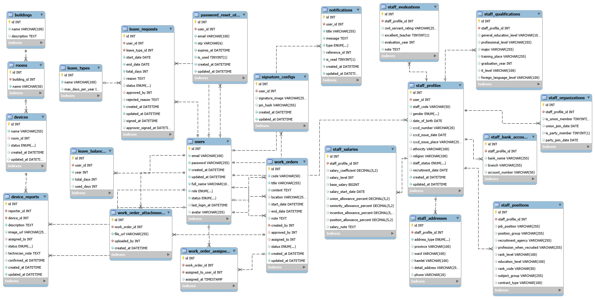
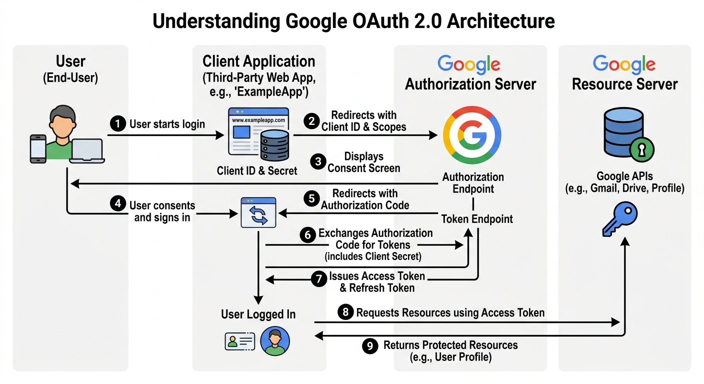
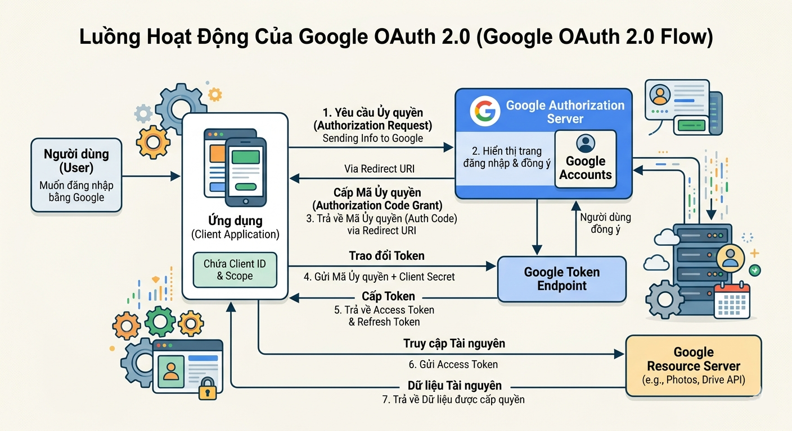
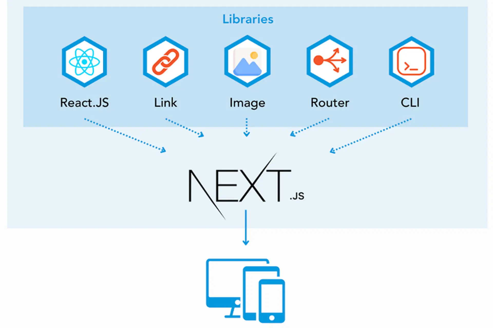

# BAOCAOTHUCTAP

Kho lưu trữ này chứa bộ tài liệu phục vụ báo cáo thực tập cho đề tài **Hệ thống Quản lý Hành chính**.

## Nội dung chính

- **Báo cáo tổng hợp**: các file báo cáo chính của đề tài.
- **Tiến độ hàng tuần**: các file theo dõi tiến độ thực tập theo từng tuần.
- **Mẫu báo cáo**: tài liệu mẫu và phiếu đánh giá dùng để tham khảo khi hoàn thiện báo cáo.
- **Hình ảnh minh họa**: các ảnh chụp màn hình, sơ đồ và hình minh họa dùng trong báo cáo.

## Cấu trúc thư mục

- `hinhanh/`: lưu hình ảnh và sơ đồ minh họa cho báo cáo.
- `maubaocao/`: lưu các mẫu báo cáo, mẫu phiếu và tài liệu tham khảo.
- `tiendohangtuan/`: lưu các file tiến độ thực tập theo từng tuần.

## Các file nổi bật

- `BaoCao_HeThongQuanLyHanhChinh.docx`: báo cáo chính của đề tài.
- `110122193_ThachThiHueTrinh_DA22TTC.docx`: tài liệu báo cáo thực tập cá nhân.
- `PHIEU_DANH_GIA_CUA_CQ_ThachThiHueTrinh.docx`: phiếu đánh giá của cơ quan thực tập.
- `BGH.jpg`, `sodomoi.png`: hình ảnh minh họa sử dụng trong nội dung báo cáo.

## Hình ảnh minh họa

Một số hình ảnh tiêu biểu trong thư mục `hinhanh/`:

## Ghi chú

Đây là repository tài liệu, không phải dự án phần mềm có mã nguồn chạy được. Nếu cần, bạn có thể mở trực tiếp các file `.docx`, `.pdf`, `.png`, `.jpg`, `.webp` bằng ứng dụng tương ứng trên Windows.
